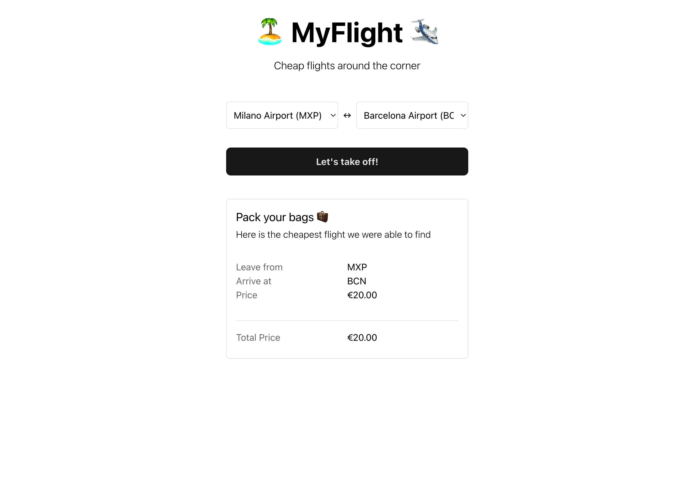

<h1 align="center">
  🏝 MyFlight 🛩
  <br>
</h1>

<h4 align="center">A simple app that retrieves the cheapest flight from a DB</h4>

<p align="center">
  <a href="#key-features">Key Features</a> •
  <a href="#how-to-use">How To Use</a> •
  <a href="#testing">Testing</a> •
  <a href="#tech-stack">Tech Stack</a> •
  <a href="#license">License</a>
</p>



## Key Features

* Select departure and arrival airport
* Airports are retrieved from DB
* Easily swap departure and arrival airports
* Find the cheapest flight, either direct or including up to 1 stopover
* Renders any error from the API
* Fully responsive
* Unit and integration tested

## How To Use

### First Setup

To clone and run this application, you'll need [Git](https://git-scm.com) installed on your computer. From your command line:

```bash
# Clone this repository
$ git clone https://github.com/oxcened/my-flight

# Go into the repository
$ cd my-flight

# You are now ready to run!
```

### Run Back-end

To run this application you will need a web server like Apache and a local MySQL DB.
An easy way of accomplishing could be by using [XAMPP](https://www.apachefriends.org/it/index.html).

Once you have that ready, follow these steps:

* Prepare DB
    * Create a local MySQL DB and import the dump located in `/api/dump.sql`
    * Set your DB info in `/utils/db_config.php`
    * Make sure that your DB is up and running
* Prepare web server
    * Place the application files in the htdocs folder or follow your web server procedure to serve the application
    * You may have to setup CORS on your web server
* Connect Front-end
    * Create `.env.local` in `/app/` and write inside of it: `VITE_API_BASE_URL={your_web_server_host}/api/`

### Run Front-end

To run this application, you'll need [Node.js](https://nodejs.org/en/download/) (which comes with [npm](http://npmjs.com)) installed on your computer. From your command line:

```bash
# Go into the repository
$ cd my-flight

# Install dependencies
$ npm install

# Run the app
$ npm run dev
```

> **Note**
> If you're using Linux Bash for Windows, [see this guide](https://www.howtogeek.com/261575/how-to-run-graphical-linux-desktop-applications-from-windows-10s-bash-shell/) or use `node` from the command prompt.

## Testing

To run unit and integration tests for the Front-end, do the following:

```bash
# Go into the app
$ cd my-flight/app

# Run the tests with Jest
$ npm run test
```

## Tech Stack

* Front-End
  * TypeScript v5
  * React v18
  * Vite.js v4
  * TailwindCSS
  * Jest + React Testing Library
* Back-end
  * PHP v8.2
  * MySQL

## License

This project is [MIT licensed](./LICENSE).

---

> [alenajam.dev](https://alenajam.dev) &nbsp;&middot;&nbsp;
> GitHub [@oxcened](https://github.com/oxcened) &nbsp;&middot;&nbsp;
> Twitter [@oxcened](https://twitter.com/oxcened)

